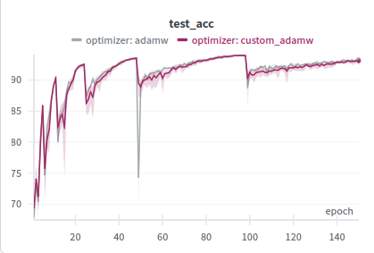

# AdamW-McGinley Dynamic Optimizer

An implementation of an AdamW variant using McGinley Dynamic-inspired adaptive momentum smoothing. This optimizer dynamically adapts the beta smoothing coefficients based on gradient change rates, potentially offering better performance on non-stationary or noisy training regimes.

## Concept

The McGinley Dynamic indicator from technical analysis proposes adaptive smoothing based on the rate of change of the signal. This project applies that concept to the AdamW optimizer's beta coefficients, dynamically adjusting them based on gradient changes:

- Instead of fixed β₁ and β₂, we use dynamic β₁ₜ and β₂ₜ computed per step
- β₁ₜ adapts based on gradient changes: β₁ₜ = β₁ / (1 + |grad_change|²)
- β₂ₜ adapts based on squared gradient changes: β₂ₜ = β₂ / (1 + |grad_sq_change|²)
- Minimum thresholds for beta values ensure stability

## Features

- `CustomAdamW` optimizer with dynamic smoothing capability
- Optional global gradient norm scaling
- Beta statistics logging integration with Weights & Biases
- Comprehensive sweep infrastructure for comparative analysis

## Installation

To install the required dependencies, run:

```bash
pip install -r requirements.txt
```

Or set up a virtual environment:

```bash
python -m venv venv
source venv/bin/activate  # On Windows: venv\Scripts\activate
pip install -r requirements.txt
```

## Usage

### Basic Usage

```python
from custom_optimizer import CustomAdamW

# Create optimizer with dynamic smoothing
optimizer = CustomAdamW(
    model.parameters(),
    lr=0.001,
    weight_decay=0.01,
    dynamic_smoothing=True,  # Enable dynamic betas
    min_beta1=0.5,          # Minimum value for beta1
    min_beta2=0.9,          # Minimum value for beta2
    log_betas=True          # Track beta statistics
)
```

### Running Experiments

Before running experiments, make sure to set up your Weights & Biases API key:

```bash
export WANDB_API_KEY=your_api_key_here
```

To run experiments comparing CustomAdamW to standard AdamW:

```bash
python sweep_train.py
```

This launches a Weights & Biases sweep that compares both optimizers across different configurations.

## Results

### Sample Comparison Test



View the full experiment result for this sweep on Weights & Biases: [AdamW-McGinley Experiments](https://wandb.ai/adriandoesai-adrian-does-a-i/adamw-cifar10?nw=nwuseradriandoesai)

## Project Structure

- `custom_optimizer.py`: Implementation of CustomAdamW optimizer
- `sweep_train.py`: Main training and sweep script for CIFAR-10 experiments
- `adamw-mcginley-dynamic-optimizer.md`: Detailed explanation of the algorithm

## License

Copyright (c) 2025 Adrian Scott.
